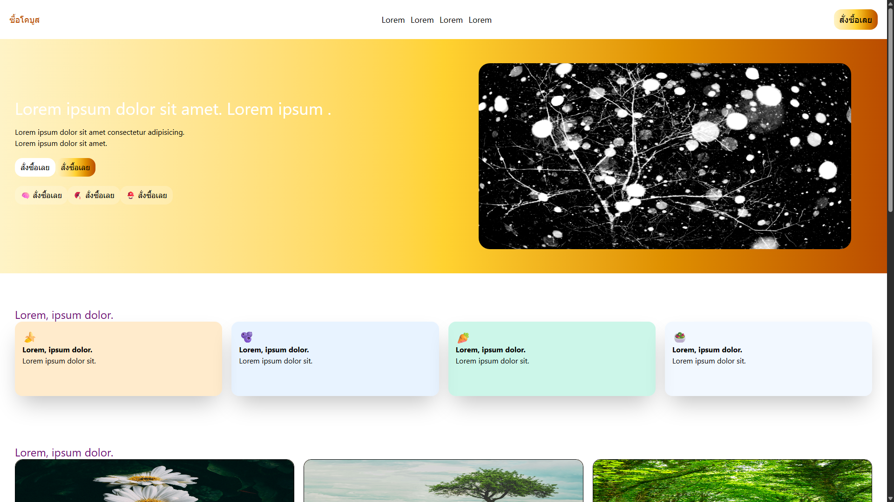
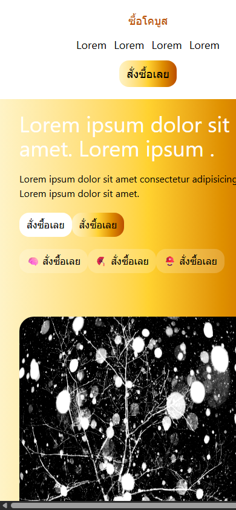
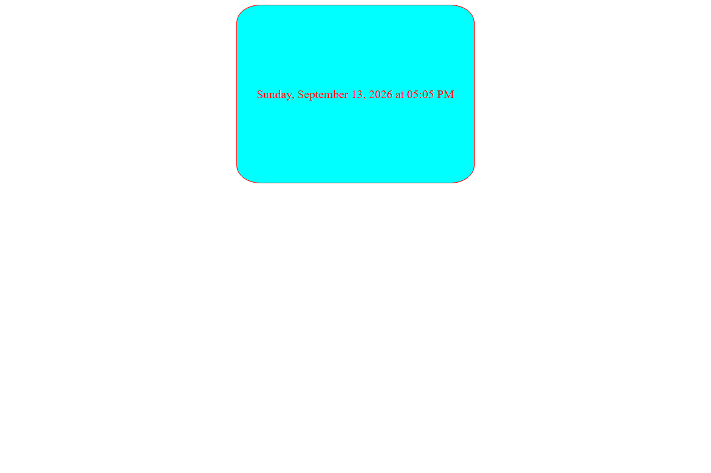
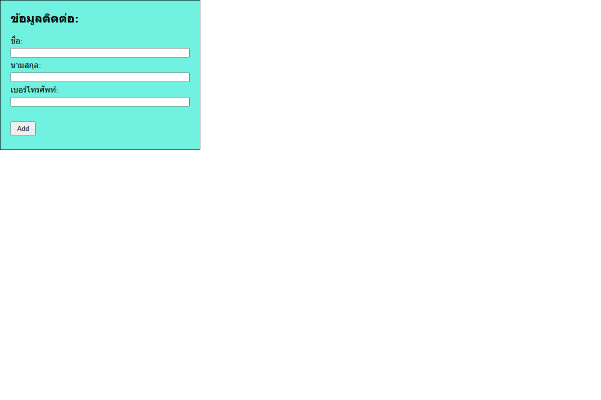
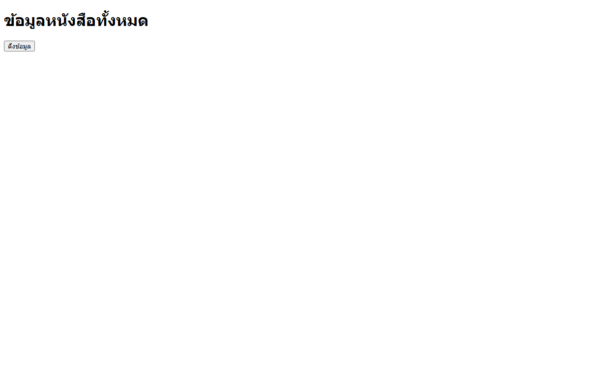
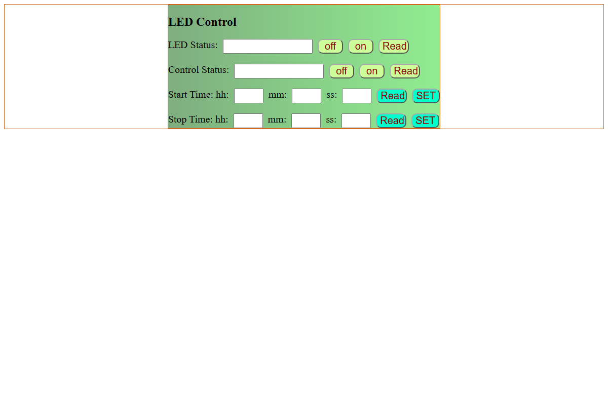

<div align="center">

# Web Application Development
### RMUTI Computer Engineering • Coursework & Lab Portfolio

<p align="center">
  
  
  
  
  
  
</p>

<p align="center">
  คลังรวบรวมงานปฏิบัติการ (Labs), ข้อสอบภาคปฏิบัติ (Exams), และสไลด์ประกอบการเรียน<br />
  รายวิชา <b>การพัฒนาเว็บแอปพลิเคชัน (Web Application Development)</b><br />
  สาขาวิชาวิศวกรรมคอมพิวเตอร์ คณะวิศวกรรมศาสตร์และเทคโนโลยี มหาวิทยาลัยเทคโนโลยีราชมงคลอีสาน
</p>

</div>

---

> [!NOTE]
> **โครงงานขนาดใหญ่ (Clone Project - Louis Vuitton E-Commerce):**  
> โปรเจกต์ร้านค้าออนไลน์ระดับ Luxury (Next.js, Tailwind CSS, Express API, MongoDB) ได้รับการแยกเป็น Repository อิสระเรียบร้อยแล้ว:  
> [**firstphethay11/louis-vuitton-fullstack**](https://github.com/firstphethay11/louis-vuitton-fullstack)

---

## ผลงานและการรันภาคปฏิบัติ (Visual Showcase)

รวมภาพตัวอย่างผลลัพธ์การทำงานจริงของข้อสอบและการทดลองในห้องปฏิบัติการ

### 1. ข้อสอบกลางภาค: Responsive Landing Page (Tailwind CSS)
ออกแบบและพัฒนาหน้าเว็บไซต์แบบ Responsive สมบูรณ์แบบ รองรับทุกหน้าจอด้วย Tailwind CSS Grid และ Flexbox

| Desktop View (1280px) | Mobile Responsive (390px) |
| :---: | :---: |
|  |  |
| *Layout กว้าง คอลัมน์สมดุล ระบบ Hero & Product Cards* | *การจัดเรียงองค์ประกอบอัตโนมัติบนสมาร์ตโฟน* |

---

### 2. งานปฏิบัติการและการเชื่อมต่อ Web API (Labs & API Integration)

<table align="center" width="100%">
  <tr>
    <td width="50%" align="center" valign="top">
      <h4>Weather API Real-Time Forecast</h4>
      
      <p align="left"><sub>ดึงข้อมูลพยากรณ์อากาศแบบเรียลไทม์ผ่าน OpenWeather API ด้วย <code>fetch()</code> แสดงอุณหภูมิ สภาพอากาศ และระดับความชื้น</sub></p>
    </td>
    <td width="50%" align="center" valign="top">
      <h4>Dynamic DOM Table & Form Validation</h4>
      
      <p align="left"><sub>ระบบบันทึกข้อมูลและตรวจสอบความถูกต้องของฟอร์ม (Validation) ก่อน Render ข้อมูลลงตาราง HTML แบบไดนามิก</sub></p>
    </td>
  </tr>
  <tr>
    <td width="50%" align="center" valign="top">
      <h4>Book API & Async Data Fetcher</h4>
      
      <p align="left"><sub>การจัดการข้อมูลแบบ Asynchronous จำลอง REST API สำหรับสืบค้นและแสดงรายการหนังสือ</sub></p>
    </td>
    <td width="50%" align="center" valign="top">
      <h4>IoT Smart LED & Device Web Controller</h4>
      
      <p align="left"><sub>หน้าควบคุมฮาร์ดแวร์ IoT สวิตช์เปิด-ปิดไฟอัจฉริยะ พร้อมระบบตั้งเวลาทำงาน (Timer) และมอนิเตอร์สถานะ</sub></p>
    </td>
  </tr>
</table>

---

## แผนผังโครงสร้างโฟลเดอร์ (Directory Structure)

```
web-dev-coursework/
├── labs/                # งานปฏิบัติการและแบบฝึกหัดประจำสัปดาห์
│   ├── javascript-basic/   # พื้นฐาน JavaScript (Ex. 1-5)
│   ├── javascript-get-api/ # การดึงข้อมูลภายนอกผ่าน Fetch API
│   ├── lab8-mock-data/     # การสร้าง Mock Data และการจำลองระบบ
│   ├── week10/             # ปฏิบัติการสัปดาห์ที่ 10 (Lab 1 & 2)
│   ├── week12/             # โครงสร้าง Clean Architecture REST API
│   ├── mysql/              # การเชื่อมต่อฐานข้อมูลเชิงสัมพันธ์ MySQL
│   ├── nodejs-intro/       # การเริ่มต้นใช้งาน Node.js Runtime
│   └── book-api-lab/       # ระบบจัดการข้อมูลหนังสือเชื่อมต่อ MongoDB
│
├── exams/               # งานสอบภาคปฏิบัติ
│   ├── midterm-tailwind/   # สอบกลางภาค: หน้าเว็บ Responsive ด้วย Tailwind CSS
│   └── final-exam-api/     # สอบปลายภาค: REST API (Node.js, Express, MongoDB)
│
├── course-slides/       # สไลด์และเอกสารประกอบการบรรยาย (PDF 8 ชุด)
└── others/              # งานทดลองและสคริปต์เสริม (AI test, JS test, Web tools)
```

---

## เครื่องมือและเทคโนโลยีที่ใช้ (Tech Stack)

<div align="center">

| ประเภท | เทคโนโลยีและเครื่องมือ |
| :--- | :--- |
| **Frontend** |     |
| **Backend** |    |
| **Databases** |   |
| **Dev Tools** |     |

</div>

---

## ข้อมูลผู้จัดทำ (Author)

<div align="center">

**นายจิรวัฒน์ เทียมทะนงค์ (Jirawat Thiamthanong)**  
นักศึกษาสาขาวิชาวิศวกรรมคอมพิวเตอร์ (Computer Engineering)  
คณะวิศวกรรมศาสตร์และเทคโนโลยี มหาวิทยาลัยเทคโนโลยีราชมงคลอีสาน (RMUTI)  
รหัสนักศึกษา: `66172110399-8`

[](https://github.com/firstphethay11)

</div>
