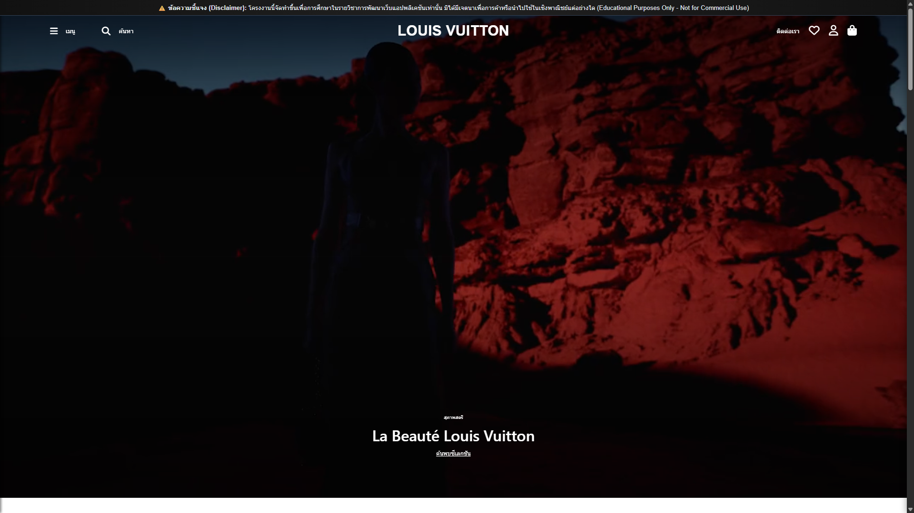
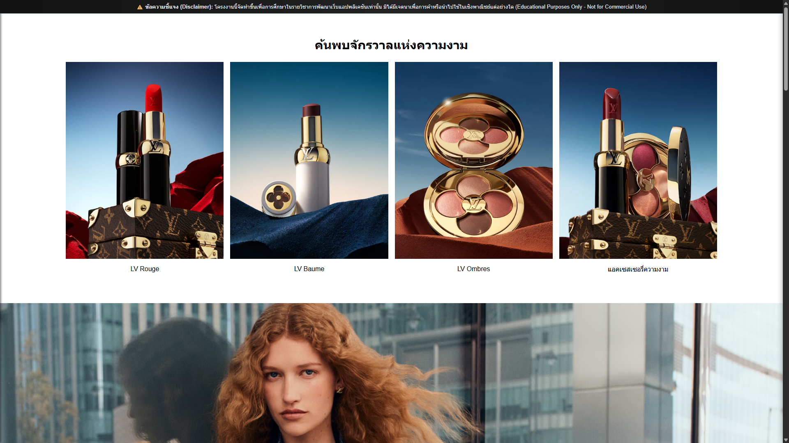
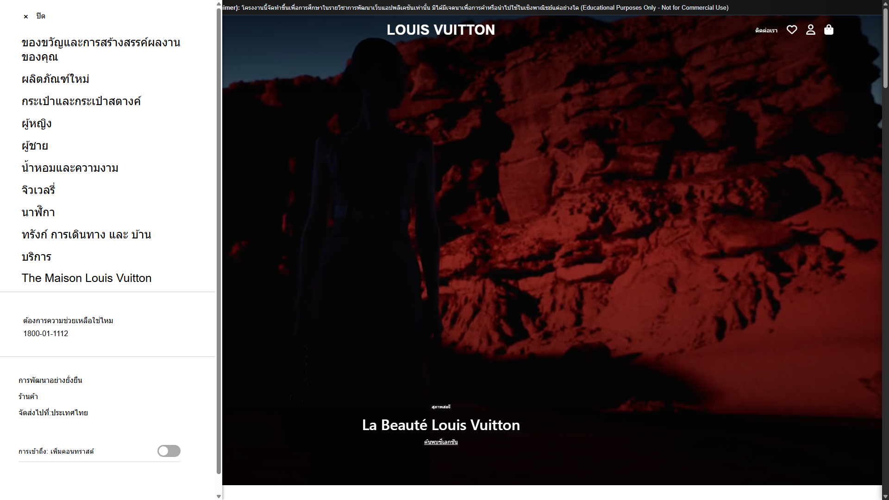
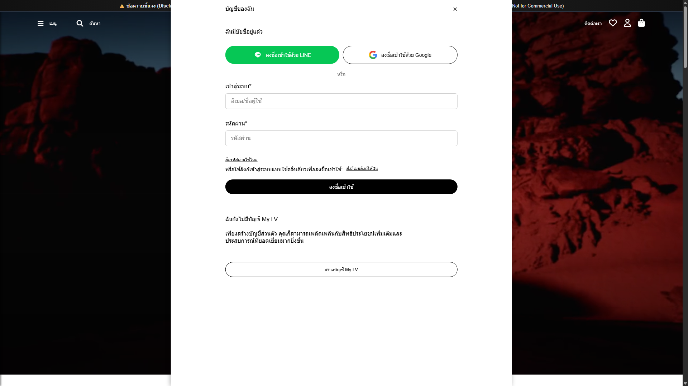
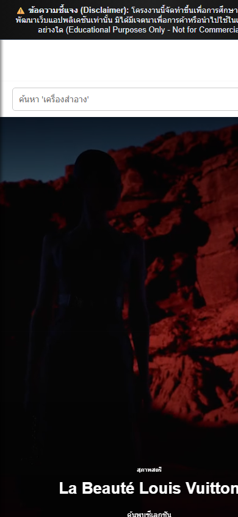
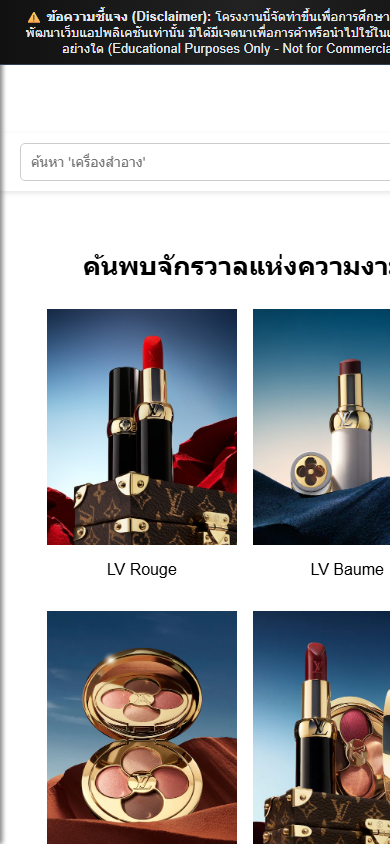
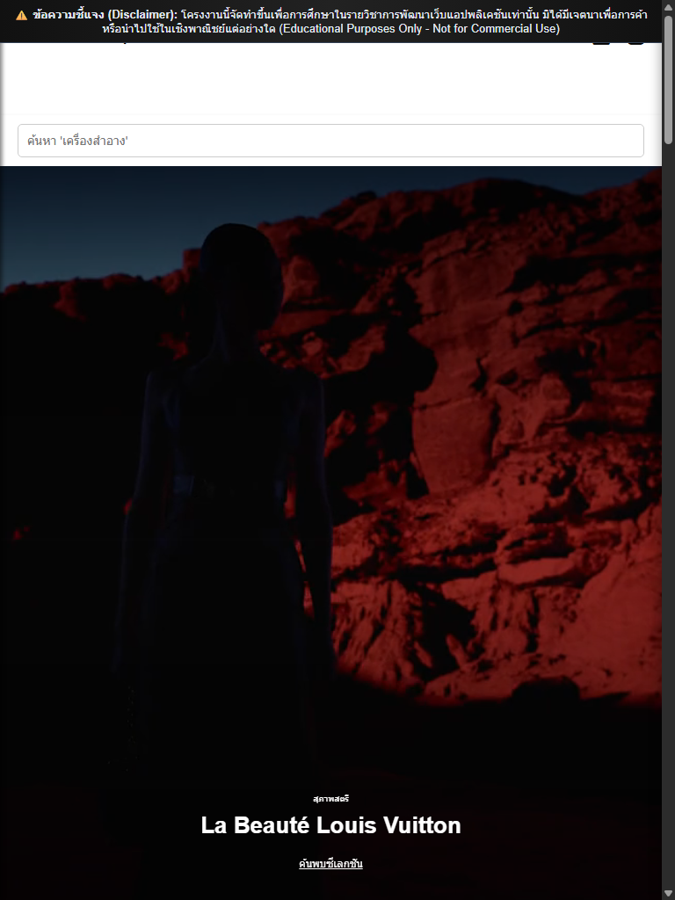

# 🛍️ Louis Vuitton E-Commerce Web Simulation (Full-Stack)

<p align="center">
  
  
  
  
  
  
  
  
</p>

---

> [!IMPORTANT]
> ### ⚠️ ข้อความชี้แจงเพื่อการศึกษา (Educational Disclaimer)
> โครงงานนี้จัดทำขึ้นเพื่อ **วัตถุประสงค์ทางการศึกษาและการเรียนรู้การพัฒนาเว็บแอปพลิเคชันเท่านั้น** ในหลักสูตรวิศวกรรมคอมพิวเตอร์ มหาวิทยาลัยเทคโนโลยีราชมงคลอีสาน (RMUTI)  
> **มิได้มีเจตนาเพื่อการค้า การพาณิชย์ หรือแสวงหาผลประโยชน์ทางธุรกิจแต่อย่างใด**  
> เครื่องหมายการค้า ชื่อแบรนด์ โลโก้ รูปภาพสินค้า วิดีโอ และทรัพย์สินทางปัญญาที่เกี่ยวข้องทั้งหมดเป็นลิขสิทธิ์ของแบรนด์ **Louis Vuitton (LVMH)** ทางผู้จัดทำเคารพในสิทธิ์ของเจ้าของเครื่องหมายการค้าอย่างเคร่งครัด

---

## 📸 ภาพตัวอย่างหน้าจอระบบ (Responsive Screenshots Showcase)

### 🖥️ 1. Desktop Experience (มุมมองคอมพิวเตอร์เดสก์ท็อป)

#### 🌟 หน้าแรกและส่วนนำเสนอ (Hero Section & Video Background)


#### 💄 แคตตาล็อกและรายการสินค้า (Product Catalog & Category Grid)


#### 📋 เมนูแถบข้างและหน้าต่างเข้าสู่ระบบ (Sidebar Menu & Login Modal)
<table>
  <tr>
    <td width="50%" align="center">
      <strong>เมนูนำทางแบบสไลด์ (Slide-out Sidebar Navigation)</strong><br/>
      
    </td>
    <td width="50%" align="center">
      <strong>หน้าต่างเข้าสู่ระบบ (Login Modal with LINE & Google)</strong><br/>
      
    </td>
  </tr>
</table>

---

### 📱 2. Mobile & Tablet Responsive (มุมมองมือถือและแท็บเล็ต)

รองรับการใช้งานบนทุกอุปกรณ์ด้วยระบบ Responsive Layout ปรับขนาดอัตโนมัติตามหน้าจอ

<table>
  <tr>
    <td width="33%" align="center">
      <strong>📱 Mobile Hero (iPhone)</strong><br/>
      
    </td>
    <td width="33%" align="center">
      <strong>🛍️ Mobile Catalog</strong><br/>
      
    </td>
    <td width="34%" align="center">
      <strong>📟 Tablet View (iPad)</strong><br/>
      
    </td>
  </tr>
</table>

---

## 🏗️ โครงสร้างระบบ (Architecture)

```
louis-vuitton/
├── frontend/                     # ฝั่งหน้าบ้าน (Client-side)
│   ├── CSS/
│   │   └── index.css             # ตกแต่งสไตล์หรูหรา และ Media Queries รองรับ Responsive
│   ├── js/
│   │   └── index.js              # ตรรกะการทำงาน, Session ID, ตะกร้าสินค้า และเรียก API
│   ├── img/                      # โลโก้ รูปภาพสินค้า และไอคอนต่างๆ
│   └── index.html                # หน้าเว็บหลักพร้อมแบนเนอร์ชี้แจงเพื่อการศึกษา
├── backend/                      # ฝั่งหลังบ้าน (Server-side API)
│   ├── src/
│   │   ├── cart/                 # API จัดการตะกร้าสินค้า (เพิ่ม, ลบ, ดูรายการ)
│   │   ├── categories/           # API หมวดหมู่สินค้า
│   │   ├── products/             # API รายการสินค้า
│   │   ├── mysql.db.js           # โมดูลเชื่อมต่อฐานข้อมูล MySQL
│   │   └── index.js              # Entrypoint สำหรับ Express API Server
│   ├── .env.example              # ตัวอย่างไฟล์ Config ฐานข้อมูล
│   └── package.json              # รายการ Dependencies
├── docs/                         # เอกสารประกอบโครงงาน
│   ├── word-report/              # เล่มรายงานโครงงานฉบับสมบูรณ์ (.docx)
│   └── pdf-presentation/         # รายงานสรุปและสไลด์นำเสนอ (.pdf)
├── screenshots/                  # รวบรวมภาพหน้าจอตัวอย่างทั้ง Desktop, Tablet, Mobile
└── louisvuitton.code-workspace   # ไฟล์ Workspace สำหรับเปิดพัฒนาบน VS Code
```

---

## ⚡ วิธีการติดตั้งและรันโปรเจกต์ (Getting Started)

### 1. ฝั่ง Backend API:
```bash
cd backend
npm install
cp .env.example .env
# แก้ไขค่า DB_HOST, DB_USER, DB_PASSWORD ในไฟล์ .env ให้ตรงกับ MySQL ของคุณ
npm start
```
*API จะรันที่พอร์ต `http://localhost:3001`*

### 2. ฝั่ง Frontend:
- เปิดไฟล์ `frontend/index.html` ผ่าน Live Server ใน VS Code หรือดับเบิลคลิกเปิดบนเบราว์เซอร์ได้ทันที!
- หรือเปิดผ่านไฟล์ `louisvuitton.code-workspace` เพื่อแก้ไขทั้ง Frontend และ Backend ร่วมกัน

---

## 👤 ข้อมูลผู้จัดทำ (Author)
- **นายจิรวัฒน์ เทียมทะนงค์ (Jirawat Thiamthanong)**
- รหัสนักศึกษา: 66172110399-8  
- สาขาวิชาวิศวกรรมคอมพิวเตอร์ คณะวิศวกรรมศาสตร์และเทคโนโลยี มหาวิทยาลัยเทคโนโลยีราชมงคลอีสาน (RMUTI)
